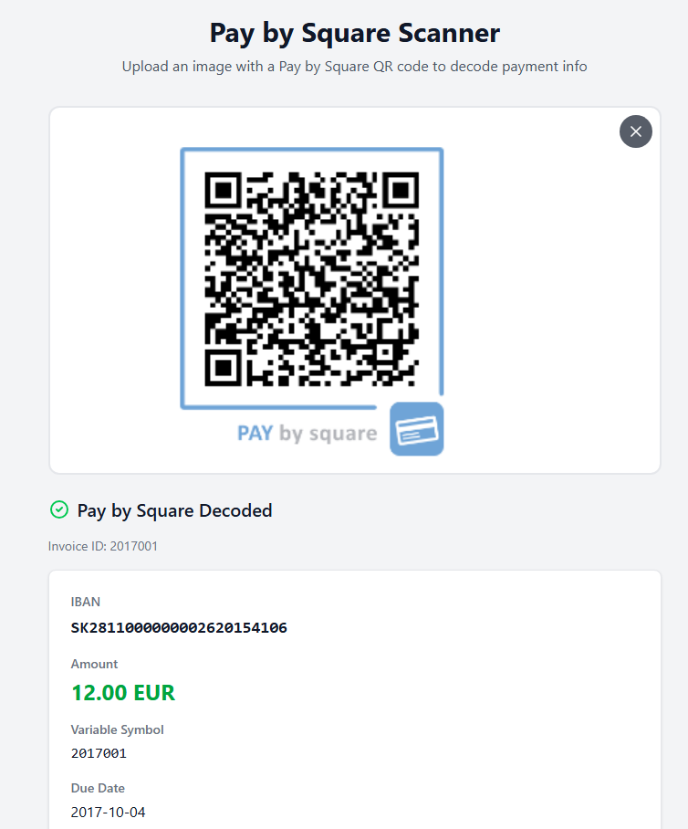
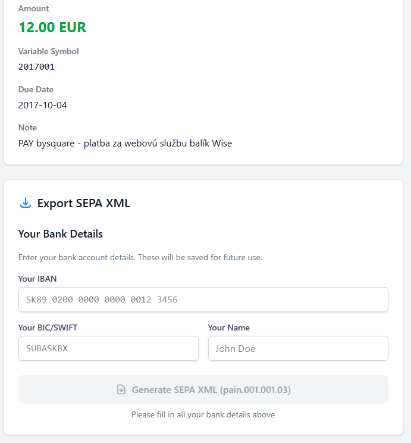

# Pay-by-square payments

Simple tool that can decode Slovak pay-by-square QR codes and prepare SEPA XML import file.

You can use it [right here](https://sodik82.github.io/pay-by-square-payments/)

## Functionality

Upload or paste from clipboard image that contains PAY by square QR code.

And then you can generate SEPA XML (pain.001) file with payment that you can imported to your bank. You have to enter your (debtor) information which are stored in local storage.

## Motivation

This is primarily intended for desktops when you don't have (or don't want to use) mobile internate banking application.

